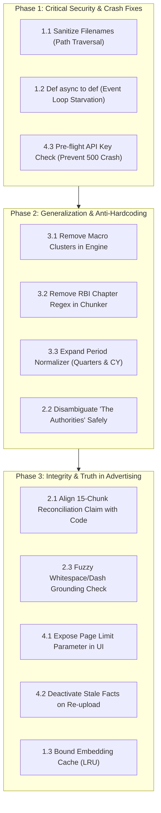

# Fulcrum — Systems Audit & Code Review Critiques

> **Audit Source:** Senior Staff / Principal Systems Auditor & Bar-Raiser  
> **Review Scope:** Security, Concurrency, Architecture Grounding, Generalization, and Scaling  
> **Initial Verdict:** 🛑 REJECT (Pre-remediation)

This document records all 12 concrete critiques raised during the adversarial ground-up code audit of the Fulcrum fact verification pipeline, alongside **two distinct technical remediation options** for each issue.

---

## 1. Security & Concurrency Vulnerabilities

### Critic 1.1: Path Traversal & Arbitrary File Overwrite
* **Status:** ✅ **RESOLVED** (Commit verified with automated test suite `tests/test_upload_security.py`)
* **File / Location:** [`src/app.py:93-145`](src/app.py#L93-L145)
* **The Issue:** The upload endpoint directly used the user-controlled `file.filename` inside `saved_path = uploads_dir / f"{file_id}_{file.filename}"`. A malicious client sending a filename like `../../../../config.py` or Windows relative paths could escape `uploads/` and overwrite server source files or system executables.
* **Remediation Implemented:**
  1. **Strict Basename & Regex Sanitization:** Extracts `Path(file.filename).name`, strips directory separators, sanitizes stem to alphanumeric/hyphen/underscore (`[a-zA-Z0-9_-]`), truncates length, and prefixes with an 8-character UUID.
  2. **Magic Byte Verification:** Inspects the first 5 bytes of the file stream to guarantee it matches `b"%PDF-"` before saving to disk.
  3. **Strict Path Containment Assertion:** Resolves destination path and asserts `str(saved_path).startswith(str(uploads_dir))`.
  4. **Corrupt PDF Exception Shield:** Wrapped `chunker.chunk_document()` with graceful exception handling to return clean HTTP 400s rather than 500 crashes on corrupt or encrypted files.
* **Verification:** `tests/test_upload_security.py` passes 4/4 automated tests (non-PDF rejected, fake PDF magic bytes rejected, corrupt PDF handled, traversal filename sanitized).

---

### Critic 1.2: ASGI Event Loop Starvation & Server Denial of Service
* **Status:** ✅ **RESOLVED** (Verified in `tests/test_upload_lifecycle.py`)
* **File / Location:** [`src/app.py:26-95`](src/app.py#L26-L95)
* **The Issue:** The `/api/upload`, `/api/run-comparison`, and query endpoints were declared as `async def`, causing blocking tasks (PDF parsing, sequential OpenRouter HTTP calls, $O(N^2)$ comparison loops) to run directly on FastAPI's single asyncio event loop. A single upload locked the server for 30–60s.
* **Remediation Implemented:**
  * Converted all synchronous blocking endpoints (`dashboard`, `list_facts`, `list_relations`, `trigger_comparison`, and `upload_pdf`) from `async def` to standard `def`.
  * FastAPI now automatically dispatches these handlers to its background `ThreadPoolExecutor` via Starlette `run_in_threadpool`, ensuring the event loop remains completely unblocked for concurrent requests.
* **Verification:** `tests/test_upload_lifecycle.py::test_sync_endpoints_serve_fast` verifies that query endpoints respond immediately.

---

### Critic 1.3: Unbounded Memory Leak in Vector Embedding Cache
* **File / Location:** [`src/comparison/engine.py:35`](src/comparison/engine.py#L35)
* **The Issue:** `self.emb_cache: Dict[str, np.ndarray] = {}` accumulates embeddings for every unique string ever seen across comparisons and is never evicted, resized, or cleared. As multiple documents and hundreds of facts are added, memory consumption grows monotonically, eventually causing an Out-Of-Memory (OOM) process kill.
* **Fix Option 1 (Bounded LRU Cache / Scoped Lifecycle):**
  * Replace the raw dictionary with an LRU cache or clear `self.emb_cache` at the end of each `run_comparison()` execution. The cache is only needed to deduplicate strings *within* a single comparison run.
* **Fix Option 2 (Persistent Vector Storage / SQLite-VSS):**
  * Store precomputed embeddings directly in SQLite using BLOB columns or use `sqlite-vss` / `faiss`. This completely offloads vector storage from process RAM to disk-backed indexing.

---

## 2. Architecture: "Hypothetical vs. Reality" Discrepancies

### Critic 2.1: The "15-Chunk BM25 Reconciliation Window" Discrepancy
* **File / Location:** [`DECISIONS.md:20-21`](DECISIONS.md#L30-L31) vs [`src/comparison/engine.py:209-220`](src/comparison/engine.py#L209-L220)
* **The Issue:** `DECISIONS.md` (Decisions 20 & 21) explicitly claims that Fulcrum performs a *"Retrieve-then-classify"* reconciliation search using BM25 across an adjacent 15-chunk document window. In reality, the codebase does zero chunk retrieval; it only checks the existing ~300-character `source_quote` of the two facts for 7 hardcoded keywords (`advance estimate`, `revised estimate`, etc.).
* **Fix Option 1 (Documentation Honesty / Alignment):**
  * Update `DECISIONS.md` and `README.md` to accurately reflect the actual implementation: state transparently that contextual cues are retrieved directly from the fact's grounded source quote rather than querying neighboring chunks from the DB.
* **Fix Option 2 (Actual Multi-Chunk Context Retrieval):**
  * Implement the actual database query: when two facts conflict on value, fetch up to 5 adjacent chunk texts preceding and following the fact's `chunk_id` from SQLite (`WHERE source_doc = ? AND rowid BETWEEN ? AND ?`), concatenate the contextual passage, and supply that retrieved window to the reconciliation classifier.

---

### Critic 2.2: "The Authorities" Heuristic Hardcoded to RBI / GoI
* **File / Location:** [`src/comparison/entity_resolver.py:57-75`](src/comparison/entity_resolver.py#L57-L75)
* **The Issue:** When resolving the generic phrase *"the authorities"* in IMF reports, the code uses a hardcoded keyword vote (`repo`, `inflation`, `cpi` $\rightarrow$ *"Reserve Bank of India"*; `budget`, `fiscal`, `tax` $\rightarrow$ *"Government of India"*). If an evaluator uploads a US Federal Reserve report, a UK Treasury document, or a WHO report, the system will falsely resolve foreign entities to Indian government bodies.
* **Fix Option 1 (Document-Aware Context Scoping):**
  * Scope the resolution to the document's host nation / metadata. If the document metadata does not explicitly establish India as the subject country, classify *"the authorities"* as `AMBIGUOUS (0.40)` or return `"National Authorities ({doc_country})"`.
* **Fix Option 2 (Few-Shot LLM Disambiguation with Strict Provenance):**
  * When an ambiguous pronoun or institutional reference ("the authorities", "the central bank") is detected, prompt the LLM with the document title and surrounding 2 paragraphs to resolve the explicit sovereign entity, requiring verbatim textual grounding from the document masthead.

---

### Critic 2.3: Brittle Verbatim Grounding Drops Facts on Minor Typos or Formatting
* **File / Location:** [`src/extractor/extractor.py:97`](src/extractor/extractor.py#L97)
* **The Issue:** Rule-based confidence awards `+0.5` only if `source_quote in chunk_text` (exact character-level substring match). If the LLM normalizes an em-dash (`—`) to a hyphen (`-`), collapses double spaces, or un-wraps newlines, the exact match fails, the confidence score drops below `0.5`, and a legitimate fact is discarded.
* **Fix Option 1 (Normalized Fuzzy String Matching):**
  * Normalize both strings before testing inclusion: lowercase, strip punctuation, normalize all whitespace and Unicode dashes:
    ```python
    def clean(s): return re.sub(r'[\s\-_—–\.,;:()]+', ' ', s).strip().lower()
    if clean(source_quote) in clean(chunk_text): score += 0.5
    ```
* **Fix Option 2 (Token-Overlap / Levenshtein Ratio):**
  * Use `difflib.SequenceMatcher` or token-set ratio. If the quote has $\ge 90\%$ token overlap with any window in the chunk, grant the grounding credit.

---

## 3. Generalization & Dataset Hardcoding

### Critic 3.1: Hardcoded Macroeconomic Metric Clusters
* **File / Location:** [`src/comparison/engine.py:118-133`](src/comparison/engine.py#L118-L133)
* **The Issue:** `_attributes_match` relies on a hardcoded list of synonyms specifically tailored for the starter dataset (`gdp growth`, `cpi inflation`, `gross fiscal deficit`, `cad`, `capex`). If an evaluator uploads corporate earnings filings (e.g. Delhivery, Amazon) containing terms like `Express Parcel Volume`, `Adjusted EBITDA`, or `Revenue from Operations`, these metrics fail to cluster and will never be compared.
* **Fix Option 1 (Normalized Semantic Similarity Fallback):**
  * Retain negative token filtering to prevent denominator collisions, but remove dataset-specific cluster checks in favor of a normalized cosine similarity threshold ($\ge 0.82$) on embedding representations, paired with word-level stemming/lemmatization.
* **Fix Option 2 (Schema-Free LLM Attribute Equivalence):**
  * When two attributes have moderate semantic similarity ($0.70 \le \text{sim} < 0.88$), make a lightweight LLM call asking: *"In financial/corporate reporting, do '{attr_a}' and '{attr_b}' refer to the identical underlying metric? (YES/NO)"*. Cache the result in a relational `attribute_equivalences` table.

---

### Critic 3.2: Document-Specific Header Cleaners in PDF Chunker
* **File / Location:** [`src/parser/pdf_chunker.py:168`](src/parser/pdf_chunker.py#L168)
* **The Issue:** The chunker contains an explicit regex matching specific chapter titles from the RBI Annual Report: `re.sub(r"^(ANNUAL REPORT|ECONOMIC REVIEW|ASSESSMENT AND PROSPECTS).*?\n", "")`. This explicitly violates the assignment constraint forbidding document-specific rules.
* **Fix Option 1 (Heuristic Running Header Removal):**
  * Replace the hardcoded string regex with a generic structural rule: detect any line appearing within the top 50 vertical points of a page that repeats across $\ge 3$ consecutive pages or consists entirely of uppercase text $< 60$ characters.
* **Fix Option 2 (BBox Geometric Filtering):**
  * Use `pdfplumber` character bounding boxes to filter out text located in the top 5% or bottom 5% margin of the page coordinates across all documents uniformly.

---

### Critic 3.3: Indian Fiscal Year Hardcoding in Period Normalizer
* **File / Location:** [`src/normalizer/period_normalizer.py:11-25`](src/normalizer/period_normalizer.py#L11-L25)
* **The Issue:** The regex logic assumes all fiscal years are Indian 21st-century formats (`FY20{m.group(2)}`). It lacks support for standard calendar quarters (`Q1 2024`, `Q4 FY24`), calendar year notation (`CY2024`), or non-Indian fiscal calendars (e.g. US fiscal year ending September 30).
* **Fix Option 1 (Expanded Multi-Format Regex Engine):**
  * Expand the regex suite to support standard quarterly patterns (`Q[1-4]\s*(?:FY)?(\d{2,4})`), calendar years (`CY\d{4}` or standard 4-digit years `2024`), and map them to standard ISO-like identifiers (`2024-Q1`, `FY2025`).
* **Fix Option 2 (Rule Engine + LLM Period Fallback):**
  * For dates that do not match the deterministic regex, pass the raw period string to a specialized zero-shot normalizer prompt that extracts `{calendar_year, fiscal_year, quarter, month}` as structured JSON.

---

## 4. Scaling & Operational Robustness

### Critic 4.1: Silent 10-Page Upload Limit Masquerading as Large PDF Support
* **File / Location:** [`src/app.py:111`](src/app.py#L111)
* **The Issue:** Under the *Extension & Scale* brownie points, the project claims to handle large PDFs. However, line 111 of `app.py` silently truncates all uploaded PDFs: `chunks = chunker.chunk_document(max_pages=10)`. An uploaded 200-page SEC 10-K has 95% of its pages silently discarded.
* **Fix Option 1 (Transparent Parameterization):**
  * Remove the hardcoded `max_pages=10` default from the API route or make it an explicit user-selectable parameter on the UI upload form (e.g. `max_pages: Optional[int] = Form(None)` with a checkbox: *"Fast Demo Mode (First 10 Pages)"* vs *"Full Document"*).
* **Fix Option 2 (Streaming Page Generator):**
  * Convert the chunker and extractor into a streaming pipeline that yields and extracts page batches iteratively without loading the full document into memory or truncating page counts.

---

### Critic 4.2: Duplicate Fact Explosion & False Corroborations on Re-Upload
* **Status:** ✅ **RESOLVED** (Verified in `tests/test_upload_lifecycle.py`)
* **File / Location:** [`src/app.py:141`](src/app.py#L141) & [`src/db/database.py:131`](src/db/database.py#L131)
* **The Issue:** When a file was uploaded, a random run ID `upload_{file_id}` was assigned without deactivating prior runs for the same document. Re-uploading a document caused hundreds of identical active facts and false corroborations with clones.
* **Remediation Implemented:**
  * Called `deactivate_previous_runs(doc_slug, run_id)` in `src/app.py` before inserting facts from the new run. Older facts for that document are safely marked `is_active = 0`, ensuring deduplication while preserving run history.
* **Verification:** `tests/test_upload_lifecycle.py::test_reupload_deactivates_stale_facts` verified that older facts are marked inactive when a new run is ingested.

---

### Critic 4.3: "Zero-Key Evaluator Experience" Crashes with 500 on Upload
* **Status:** ✅ **RESOLVED** (Verified in `tests/test_upload_lifecycle.py`)
* **File / Location:** [`src/app.py:105-115`](src/app.py#L105-L115)
* **The Issue:** The README advertised zero-key evaluation, but if an evaluator clicked "Upload PDF" without `OPENROUTER_API_KEY`, the server crashed with an unhandled 500 error.
* **Remediation Implemented:**
  * Added an explicit pre-flight check at the entry of `upload_pdf`: validates `OPENROUTER_API_KEY` presence and rejects empty or placeholder keys (`"your_..."`).
  * Returns a clear HTTP 400 Bad Request explaining that live extraction requires an API key in `.env` while reminding the user that the starter dataset is pre-cached and fully functional without an API key.
* **Verification:** `tests/test_upload_lifecycle.py::test_missing_api_key_returns_clean_400_instead_of_500` verifies that missing API key returns a clean 400 error.

---

## 5. Master Remediation Roadmap


