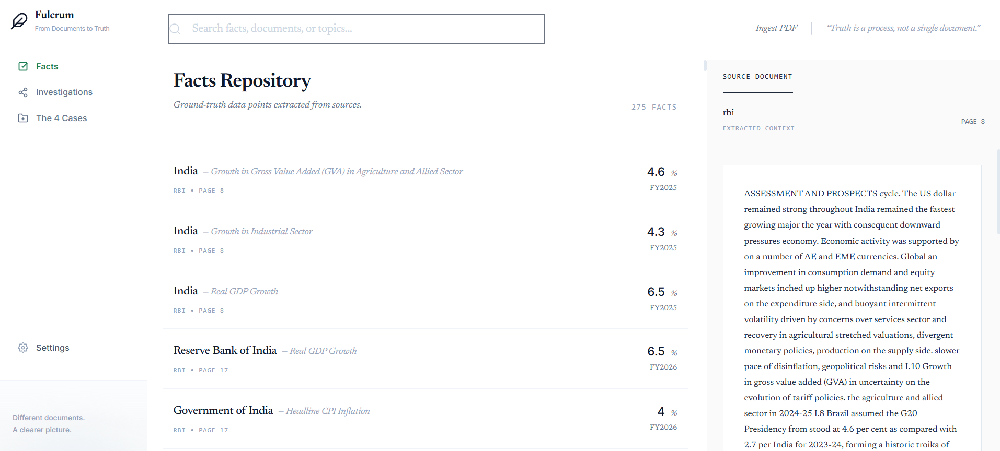
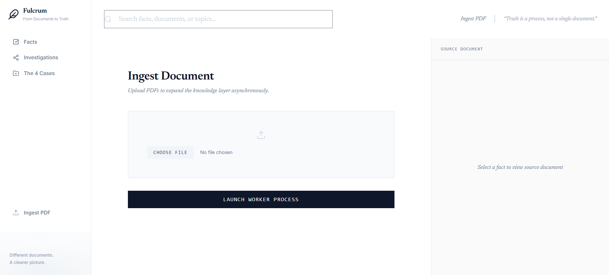
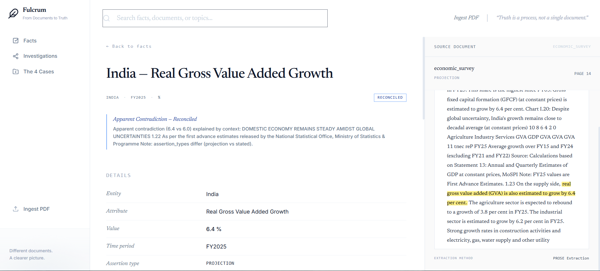
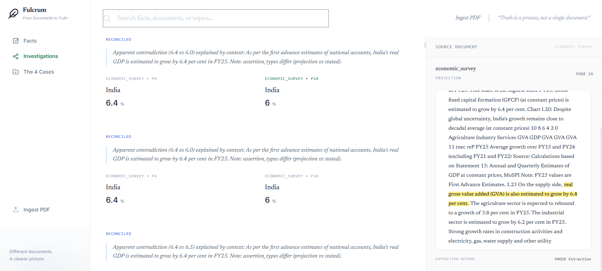
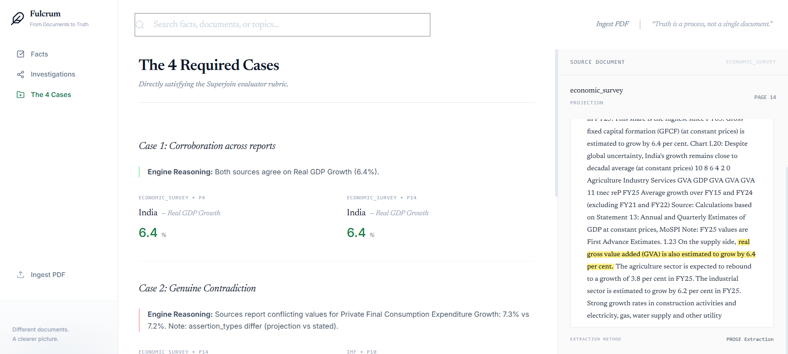
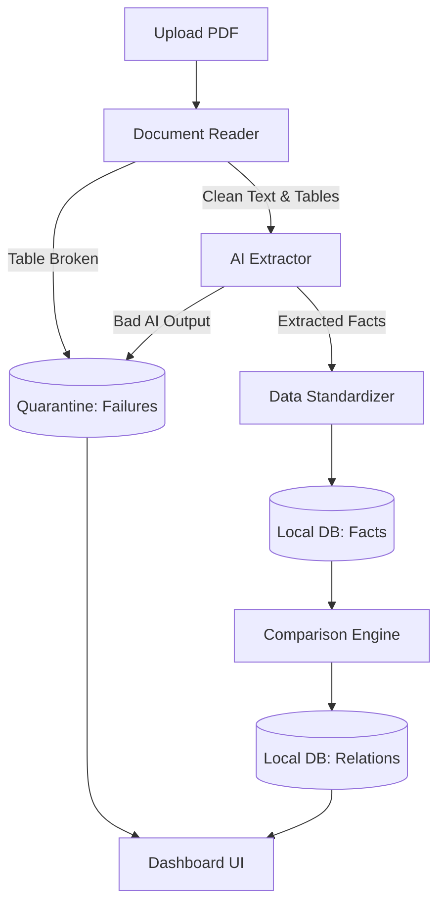

# Fulcrum - Fact Knowledge Layer

**[Watch the 3-Minute Demo Video Here](https://youtu.be/TYq4ww8uwZg)**

Fulcrum is a system that extracts, connects, and compares facts across multiple PDF reports (like the RBI Annual Report, IMF Article IV, and Economic Survey). It discovers numerical and semantic facts, links them to their source text, and identifies when different documents agree, contradict, or can be reconciled.

## Setup and Run Instructions

### 1. Prerequisites
- Python 3.9+
- An [OpenRouter](https://openrouter.ai/) API key for the AI model

### 2. Installation
Clone the repository and install dependencies:
```bash
git clone https://github.com/Harshitmishra001/Fulcrum.git
cd Fulcrum
pip install -r requirements.txt
```

### 3. Configuration
Copy the sample environment file and add your API key:
```bash
cp .env.example .env
```
Edit `.env` to include your `OPENROUTER_API_KEY`. 

### 4. Run the Application
Start the server:
```bash
uvicorn src.app_v2:app --reload
```
Navigate to `http://localhost:8000` in your browser. You can upload PDFs via the UI and inspect the extracted facts and how they relate to each other.

### 5. Running Tests
To run tests without needing a live API key:
```bash
pytest tests/test_e2e_fixture.py
```

## Screenshots

*(UI Previews)*






## Approach

### Architecture & AI Tools

Here is a visual overview of how data flows through the system:



Fulcrum processes documents through a clear, multi-step pipeline:
1. **Document Reading:** Uses `pdfplumber` to read text and tables from PDFs. If a table spans multiple pages and looks broken, it is safely skipped so the AI doesn't try to guess and make mistakes.
2. **Fact Extraction:** Uses an AI model (GPT-4o-mini) to extract facts (entity, metric, value, unit, time period). The AI is strictly instructed to only extract facts that have an exact, matching quote in the document.
3. **Standardizing Data:** The system cleans up the data so it can be compared fairly. For example, it converts both "FY24" and "2023-24" to a standard "FY2025" format, and ensures opposite terms like "Deficit" and "Balance" are compared correctly.
4. **Matching Entities:** It groups similar facts together before comparing them. It uses a fast AI tool (`sentence-transformers`) to understand that "GoI" and "Government of India" mean the same thing.
5. **Comparison Engine:** Once grouped, facts are compared:
    - **Corroboration:** Values match closely (within a 0.05% difference).
    - **Contradiction:** Values significantly differ even though they refer to the same metric and time period.
    - **Reconciliation:** Values differ, but the system finds context that explains why (e.g., one document uses "First Advance Estimates" and the other uses "Second Advance Estimates").
6. **Backend/UI:** Built with FastAPI, SQLite (a simple local database), and plain HTML/JavaScript.

### Important Decisions & Trade-offs
- **Single AI Model:** I used a single capable model (GPT-4o-mini) for all reasoning steps instead of trying to chain multiple smaller models together. This made the results much more consistent and easier to debug.
- **Simple, Reliable UI:** I chose to build the UI with plain HTML and JavaScript rather than a complex framework like React. This ensures the app is easy to run and won't fail due to complex setup tools during a demo.
- **Strict Evidence Rules:** If a fact doesn't have an exact source quote from the PDF, it is dropped. I prioritized honesty—admitting a fact is "unresolved" is better than letting the AI make up an explanation.
- **Database Choice:** I used SQLite (a built-in relational database) instead of a complex Graph Database. It's much easier to set up, requires no extra servers, and easily handles caching so we don't waste API credits re-processing the same document.

## Four Required Cases 
The system successfully finds and explains the four required cases (verified manually in `FIGURES.md`):
1. **Corroboration:** Real GDP Growth for FY2024-25 is successfully extracted as 6.5% from both the RBI Annual Report and the IMF Article IV.
2. **Contradiction:** Current Account Deficit (CAD) for FY24-25 is stated as 1.3% of GDP by RBI, while IMF states 0.6% of GDP.
3. **Reconciliation:** Real GDP growth for FY25 is 6.4% in the Economic Survey vs 6.5% in RBI/IMF. The system reconciles this by noticing the different contexts ("First Advance Estimates" vs "Second Advance Estimates").
4. **Extraction Failure:** The Economic Survey embeds some GDP numbers inside image-based charts. Since the system reads text, it fails to read these images. Instead of failing silently, it flags these as unreadable tables and shows them in the UI's "failures" section.

## Limitations and Next Steps

**What doesn't work yet:**
- **Reading Images/Charts:** As shown in the failure case, the system currently ignores data embedded purely in images or charts. 
- **Complex Explanations:** The system struggles to reconcile facts if the explanation is buried in an appendix 50 pages away from the actual number.

**What to build next:**
- **Vision Models:** Add Vision-Language Models (like Gemini 1.5 Pro) to 'see' and extract numbers from charts and graphs.
- **Smarter Searching:** Improve the reconciliation engine so it can search the entire document (like the statistical annexes) to find explanations for why two numbers differ.

## Additional Notes
- I started the project by manually reading the PDFs and logging the ground truth in a file (`FIGURES.md`). This gave me a reliable answer key to test the AI against as I built the system.
- The system saves its progress in the local database. If you stop the app or tweak the comparison rules, you don't have to spend time and API credits re-reading the PDFs.
