# Fulcrum — Fact Knowledge & Verification Layer

> **Hiring Assignment Submission**: Engineering Intern Hiring Assignment  
> Built by: Harshit Mishra

Fulcrum is a trustworthy, transparent fact knowledge layer that discovers, grounds, compares, and reconciles economic and financial claims scattered across messy documents.

Instead of treating documents as monolithic text blobs or relying on ungrounded generative summaries, Fulcrum:
1. **Chunks structurally**: Separates tabular data from prose, preserves table header context on every body row, and catches silent table parse failures.
2. **Extracts with verbatim evidence**: Extracts facts into a schema-free representation where every number or claim is tethered to a verbatim source quote, page number, and provenance.
3. **Guards comparisons**: Prevents false matches by checking assertion types (*stated outcomes vs projections/targets*) and period types (*fiscal vs calendar years*).
4. **Reasons transparently**: Identifies corroborations, contradictions, and reconciliations via context, presenting evidence in interactive **Argument Cards**.

---

## 📊 The Four Required Cases (Verified Against Ground Truth)

Every case in Fulcrum is grounded in verified document text, recorded in [`FIGURES.md`](FIGURES.md):

| Case Type | Source Documents | Metric & Period | Findings & System Reasoning |
| :--- | :--- | :--- | :--- |
| **1. Corroboration** | **RBI** (App Table 1, p. 91)<br>**IMF** (para 4, p. 10) | **Real GDP Growth** (FY2024-25) | Both independently state **6.5%**. System links claims, matches within 0.05 (5 bps) tolerance, and marks verified agreement with verbatim quotes. |
| **1. Corroboration** | **RBI** (App Table 1, p. 91)<br>**IMF** (para 5, p. 10) | **Headline CPI Inflation** (FY2024-25) | Both independently report **4.6%** average inflation for the fiscal year. |
| **2. Contradiction** | **RBI** (App Table 1, p. 92)<br>**IMF** (para 10, p. 12) | **Current Account Deficit** (FY2024-25) | **RBI reports 1.3% of GDP** deficit, while **IMF staff reports 0.6% of GDP**. System flags genuine empirical divergence between central bank data and IMF staff projections. |
| **3. Reconciliation via Context** | **Economic Survey** (p. 14)<br>**RBI Report** (p. 8, 91) | **Real GDP Growth** (FY2024-25) | Economic Survey reports **6.4%** as per *First Advance Estimates*; RBI reports **6.5%** as per *Second Advance Estimates*. The document text itself reconciles the revision vintage. |
| **3. Reconciliation via Definition** | **RBI Report** (p. 70, 91)<br>**IMF Article IV** (p. 10, 15) | **Central Govt Fiscal Deficit** (FY2024-25) | RBI reports **4.7% (RE)**; IMF reports **4.9%**, explicitly explaining: *(4.8 percent of GDP per the authorities' definition)*. Discrepancy is reconciled by definition accounting. |
| **4. Failure Case** | **Economic Survey** (p. 20, 29) | **Quarterly Growth & Itemized CPI** | Economic Survey embeds quarterly numbers inside **vector chart images** (Charts I.29, I.46) without underlying text tables. System transparently exposes why text-based PDF parsers drop visual chart data. |

---

## 🚀 Quickstart (Inspect Pre-Cached Results)

The repository includes a pre-populated SQLite database ([`fulcrum.db`](fulcrum.db)) containing **275 active facts and 125 relations** extracted from all three starter macro datasets (RBI, IMF, and Economic Survey, including genuine Case 3 reconciled relations). **You do not need an API key to run or evaluate the UI.**

### 1. Install Dependencies
```bash
pip install -r requirements.txt
```

### 2. Launch Dashboard
```bash
python -m src.app
```
Open your browser at **[http://127.0.0.1:8000](http://127.0.0.1:8000)**.

You will see:
- **Metrics Bar**: Live counts of active facts, corroborations, contradictions, and claim discrepancies.
- **Interactive Filter Tabs**: Filter by Corroboration, Contradiction, or Stated vs Projection.
- **Argument Cards**: Side-by-side claim comparisons with exact page numbers, verbatim source quotes, and reasoning.
- **Upload Form**: Upload any new PDF (e.g. corporate earnings reports) to process and cross-reference live.

---

## 🔑 Running Extraction on New PDFs (Optional)

To run live extraction on newly uploaded PDFs or re-run the extraction pipeline:
1. Create a `.env` file in the root directory:
```env
OPENROUTER_API_KEY=your_openrouter_api_key_here
LLM_BASE_URL=https://openrouter.ai/api/v1
LLM_MODEL=openai/gpt-4o-mini
```
2. Upload any PDF through the web UI at `http://127.0.0.1:8000` or use the API:
```bash
curl -X POST "http://127.0.0.1:8000/api/upload" -F "file=@sample.pdf"
```

---

## 🔄 End-to-End Pipeline Flow

```mermaid
flowchart TD
    subgraph S1["1. Document Ingestion"]
        PDF["📄 PDF Document<br/>(Annual Report, Article IV, Earnings)"] --> CHUNKER["1. Structural Chunker<br/><code>src/parser/pdf_chunker.py</code><br/>• Splits tables and prose<br/>• Preserves header hierarchy<br/>• Detects silent parse failures"]
    end

    subgraph S2["2. Fact Extraction & Grounding"]
        CHUNKER --> EXTRACTOR["2. Fact Extractor<br/><code>src/extractor/extractor.py</code><br/>• Schema-free extraction via LLM<br/>• Strict verbatim quote grounding<br/>• Rule-based confidence scoring (≥ 0.50)"]
        EXTRACTOR --> NORMALIZER["3. Deterministic Normalizers<br/><code>src/normalizer/</code><br/>• <i>period_normalizer.py</i>: Fiscal vs Calendar<br/>• <i>unit_normalizer.py</i>: Standard units & tolerance<br/>• Zero-AI deterministic parsing"]
    end

    subgraph S3["3. Immediate Persistence"]
        NORMALIZER --> DB[("4. Relational Database<br/><code>src/db/database.py</code> (SQLite)<br/>• Immediate fact commit per chunk<br/>• Run ID and active flags<br/>• Zero-loss checkpointing")]
    end

    subgraph S4["4. Resolution & Verification Engine"]
        DB --> RESOLVER["5. Entity Resolver<br/><code>src/comparison/entity_resolver.py</code><br/>• Local embeddings (all-MiniLM-L6-v2)<br/>• 3 confidence tiers (≥0.85, 0.65, reject)<br/>• 'The Authorities' 3-sentence heuristic"]
        RESOLVER --> ENGINE["6. Comparison & Reconciliation Engine<br/><code>src/comparison/engine.py</code><br/>• Attribute cluster & denominator guards<br/>• Assertion type guard (Stated vs Projection)<br/>• Tolerance check (±0.1pp / 1%)<br/>• Retrieve-then-classify reconciliation"]
    end

    subgraph S5["5. Interactive Delivery"]
        ENGINE --> CARDS["7. Argument Cards Dashboard<br/><code>src/app.py</code> + Jinja / Tailwind<br/>• Corroboration & Contradiction badges<br/>• Side-by-side verbatim quotes & pages<br/>• Zero-key evaluator mode (pre-cached DB)"]
    end

    classDef stage fill:#f8fafc,stroke:#94a3b8,stroke-width:1px,color:#0f172a;
    classDef nodeStyle fill:#ffffff,stroke:#3b82f6,stroke-width:1.5px,color:#1e293b;
    classDef dbStyle fill:#eff6ff,stroke:#2563eb,stroke-width:2px,color:#1e293b;
    classDef cardStyle fill:#f0fdf4,stroke:#16a34a,stroke-width:2px,color:#14532d;

    class S1,S2,S3,S4,S5 stage;
    class CHUNKER,EXTRACTOR,NORMALIZER,RESOLVER,ENGINE nodeStyle;
    class DB dbStyle;
    class CARDS cardStyle;
```



---

## 🏛 Architecture & Design Decisions

Every technical decision, rejected alternative, and accepted tradeoff is documented in [`DECISIONS.md`](DECISIONS.md). Key highlights:

- **No Graph DB Overhead (Decision 8)**: Uses SQLite with indexed relational pairing rather than complex graph databases. Flat classifier operating on fact pairs directly answers the core questions without graph traversal latency.
- **Local Embedding Resolution (Decision 18)**: Uses local `sentence-transformers` (`all-MiniLM-L6-v2`) for zero-cost entity similarity with 3 confidence bands (>=0.85 high, 0.65-0.85 uncertain, <0.65 reject).
- **The Authorities Heuristic (Decision 19)**: 3-sentence keyword vote resolving IMF's "the authorities" to RBI (monetary context) or GoI (fiscal context), failing safe to `AMBIGUOUS` (0.40) when uncertain.
- **Retrieve-Then-Classify Reconciliation (Decisions 20 & 21)**: Queries candidate context from source quotes and all neighboring facts within ±2 pages across both documents, asking the LLM only to classify (*YES / PARTIAL / NO*). The model is strictly forbidden from generating ungrounded facts.
- **Deterministic Normalization (Decisions 10, 34, 35, 43)**: Fiscal years (`FY2024-25` → `FY2025`), calendar periods, and units (₹ Crore, Lakhs, USD Bn, %) are normalized with deterministic regex and dimensional conversion tables, never unmonitored LLM transforms.
- **Verbatim Grounding Invariant (Decision 42)**: Any extracted fact whose quote does not appear verbatim in the source chunk text or pass an 80% token overlap threshold is discarded immediately at ingestion.
- **Concurrency & Deduplication (Decision 44)**: SQLite WAL mode and busy timeouts prevent locking across concurrent threads, while bidirectional indexing guarantees unique relation pairs.

---

## 📂 Repository Layout

```
Fulcrum/
├── src/
│   ├── app.py                     # FastAPI application & server
│   ├── config.py                  # Centralized configuration & thresholds
│   ├── comparison/
│   │   ├── engine.py              # Three-way comparison & reconciliation engine
│   │   └── entity_resolver.py     # Local embeddings + 'the authorities' heuristic
│   ├── db/
│   │   └── database.py            # SQLite schema, active run tracking, and queries
│   ├── eval/
│   │   └── golden_eval.py         # Automated grading harness for extraction
│   ├── extractor/
│   │   └── extractor.py           # OpenRouter client with retry & confidence scoring
│   ├── normalizer/
│   │   ├── period_normalizer.py   # Deterministic fiscal year / quarter regex normalizer
│   │   └── unit_normalizer.py     # Unit conversion & tolerance matching logic
│   ├── parser/
│   │   └── pdf_chunker.py         # Structural PDF chunker with table validation
│   └── templates/
│       └── index.html             # Interactive Argument Cards dashboard
├── tests/                         # Comprehensive isolated automated test suite (29 tests)
│   ├── conftest.py                # Isolated SQLite database fixture
│   ├── test_upload_security.py    # Path traversal, magic bytes, corrupt PDF rejection
│   ├── test_upload_lifecycle.py   # Sync threadpool, clean 400s, stale run deactivation
│   ├── test_generalization.py     # Bounded vector cache, corporate metrics, headers
│   ├── test_phase3_integrity.py   # Verbatim grounding, multi-fact context retrieval
│   ├── test_auditor2_remediation.py # 10 automated tests verifying 2nd bar-raiser audit fixes
│   └── test_auditor3_remediation.py # 5 automated tests verifying 3rd bar-raiser audit fixes
├── data/
│   ├── golden_set_rbi.json        # 30 hand-annotated ground truth facts for scoring
│   └── alias_eval_pairs.json      # 15 entity alias evaluation test pairs
├── starter-datasets/              # Starter PDFs (India Macro & Delhivery holdout)
├── DECISIONS.md                   # Complete architectural decision log (50 decisions)
├── FIGURES.md                     # Step 0 verified macroeconomic ground truth matrix
├── CRITICS.md                     # Ground-up adversarial audit reports & resolutions
├── requirements.txt               # Dependencies manifest
└── README.md                      # This documentation
```

---

## 🧪 Running Automated Tests

```bash
# Run the complete isolated test suite (29 tests covering security, concurrency, generalization, and grounding)
python -m pytest tests/ -v

# Run golden set evaluation against RBI hand-annotated benchmark
python -c "from src.eval.golden_eval import GoldenEvaluator; from src.db.database import get_active_facts; GoldenEvaluator().print_report(GoldenEvaluator().evaluate_facts(get_active_facts('rbi')))"
```
