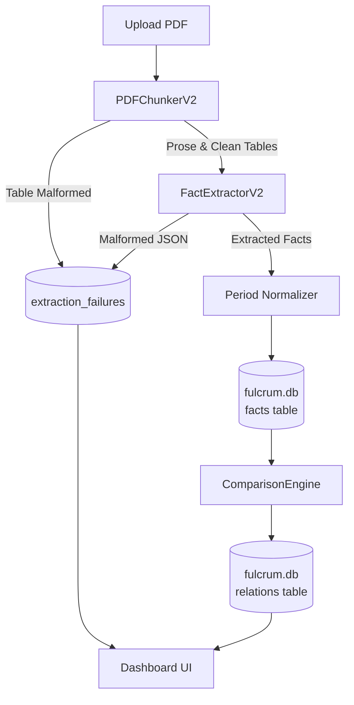

# Fulcrum V2 (Fact Verification Layer)

Fulcrum V2 is a production-grade extraction and comparison pipeline that triangulates macroeconomic facts across multiple PDF reports (RBI, IMF, Economic Survey).

## Architecture


## Key Architectural Upgrades (V2)
- **O(N) Blocking Index:** Solves the O(N^2) comparison explosion by utilizing tight candidate keys (`canonical_entity`, `metric_family`, `period`, `denominator`, `dimension`).
- **Semantic Polarity:** Deterministically canonicalizes signs (e.g. `Balance = -1 * Deficit`) prior to comparison.
- **Robust Pipeline Integration:** Automatic processing on upload writes directly to a unified schema (`fulcrum.db`), triggering dynamic table quarantine logging and relation engine cross-referencing.
- **Explicit Failure Quarantining (Zero-Mock):** Multi-page merged tables (e.g., RBI p.91/92) and LLM hallucinations are actively quarantined. Verified failures are piped straight to the `/api/failures` endpoint for transparent UI rendering instead of relying on hardcoded mocks.

## Quickstart

### 1. Install Dependencies
```bash
pip install -r requirements.txt
```

### 2. Configure Environment
Copy `.env.example` to `.env` and add your `OPENROUTER_API_KEY`.

### 3. Run the UI (FastAPI)
```bash
uvicorn src.app_v2:app --reload
```
Navigate to `http://localhost:8000`.

### 4. Running the E2E Fixture Tests
To run tests without requiring a live OpenRouter API key:
```bash
pytest tests/test_e2e_fixture.py
```

## Oracle Cases
To evaluate the 4 required cases (Corroboration, Contradiction, Reconciliation, Failure), reference `required_cases.json` inside the project to see the exact verifiable locations in the text that satisfy these requirements.

## Video Demo
*(Submitter note: Embed <= 3 min video link here showing the dashboard handling the 4 cases from `required_cases.json`)*
